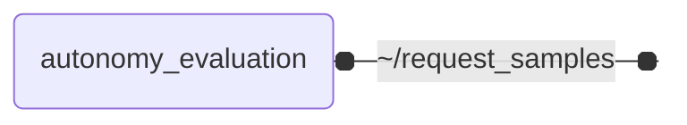

# `autonomy_evaluation`

Metrics-based evaluation of automated driving tasks, generating the evidence for benchmarking automated driving deployments

`autonomy_evaluation` is the part of the **Autonomy.Benchmarks** suite that turns the output of a system under test into
metrics. It evaluates the samples that [autonomy_datasets](https://github.com/thinking-cars/autonomy_datasets) replays
against the labels of the dataset, and reports the metrics per scene and over all evaluated samples, as the evidence
an automated driving deployment is benchmarked on.

## Nodes

### `autonomy_evaluation`

The node requests the samples it evaluates from the dataset, using the `request_samples` service
of [autonomy_datasets](https://github.com/thinking-cars/autonomy_datasets), which publishes them
and responds once they have been published. By default one sample is requested at a time, so the
dataset only publishes the next sample once the system under test has delivered its output for
the current one and the node has evaluated it. Increase `samples_per_request` to publish
samples in batches, set it to `0` to publish the whole dataset with a single request, or list the
IDs of individual samples in `sample_ids` to evaluate only those.

Once the dataset reports that all requested samples have been published, the per-sample metrics
are aggregated and reported on three levels: over all evaluated samples (`aggregated_metrics`), for
the samples of each scene the dataset published them from (`scene_results`, matched with the
samples via the `published_scene_ids` of the responses), and for every single sample
(`sample_results`). The dataset metrics are logged, and the results of all three levels are
written to a JSON file if `results_path` is set. Samples that are not evaluated within
`evaluation_timeout` seconds of being published, e.g. because the system under test skipped them,
are left out.

```bash
ros2 launch autonomy_evaluation autonomy_evaluation.launch.py \
  prediction:=/object_list/prediction \
  label:=/object_list/lidar_01 \
  request_samples:=/datasets/request_samples \
  results_path:=/results/nuscenes_lidar_object_detection.json
```

To look at the samples one by one, set `manual_playback` together with `visualize`. The node then requests no samples itself, and the samples are published with the [playback panel](https://github.com/thinking-cars/autonomy_datasets/blob/main/autonomy_datasets_rviz_plugins/README.md) in RViz instead, whose _Service_ field has to name the `request_samples` service of the dataset node (`/datasets/request_samples` by default). Every sample that arrives is evaluated and shown in RViz, and `samples_per_request`, `sample_ids` and `evaluation_timeout` have no effect. As the responses of the dataset only reach the panel, the node neither learns the scenes of the samples, so `scene_results` stays empty, nor when the dataset has ended: the results of the evaluated samples are reported once the node is stopped, e.g. with Ctrl-C, and are marked as incomplete.

```bash
ros2 launch autonomy_evaluation autonomy_evaluation.launch.py \
  prediction:=/object_list/prediction \
  label:=/object_list/lidar_01 \
  visualize:=true \
  manual_playback:=true
```



#### Service Clients

| Service | Type | Description |
| --- | --- | --- |
| `~/request_samples` | `autonomy_datasets_msgs/srv/RequestSamples` | request samples from dataset |

#### Parameters

| Parameter | Type | Default | Description |
| --- | --- | --- | --- |
| `evaluation` | `string` | `nuscenes_lidar_object_detection` | evaluation name |
| `visualize` | `bool` | `false` | publish the per-sample true positives, false positives and false negatives for RViz |
| `manual_playback` | `bool` | `false` | leave requesting the samples of the dataset to the user |
| `samples_per_request` | `int` | `1` | number of samples to request from the dataset at a time; 0 requests all remaining samples at once, 1 evaluates every sample before the next one is published |
| `sample_ids` | `string` | - | comma-separated IDs of the dataset samples to evaluate (e.g. '0,10,20'); if empty, all samples of the dataset are evaluated |
| `evaluation_timeout` | `float` | `60.0` | seconds to wait for a published sample to be evaluated before continuing without it |
| `results_path` | `string` | - | path of the JSON file the evaluation results are written to; results are only logged if empty |

## Launch Files

### [`autonomy_evaluation.launch.py`](launch/autonomy_evaluation.launch.py)

| Argument | Default | Description |
| --- | --- | --- |
| `request_samples` | `"~/request_samples"` | service of the dataset node used to request the samples to evaluate |
| `evaluation` | `"nuscenes_lidar_object_detection"` | evaluation to run |
| `name` | `"autonomy_evaluation"` | node name |
| `namespace` | `""` | node namespace |
| `log_level` | `"info"` | ros logging level |
| `use_sim_time` | `"true"` | use sim time |
| `visualize` | `"false"` | publish the per-sample true positives, false positives and false negatives and open RViz |
| `manual_playback` | `"false"` | request the samples to evaluate via the playback panel in RViz instead of one after another, and open RViz on it |
| `samples_per_request` | `"1"` | number of samples to request from the dataset at a time (0 requests all remaining samples at once) |
| `sample_ids` | `""` | comma-separated IDs of the dataset samples to evaluate (all samples if empty) |
| `evaluation_timeout` | `"60.0"` | seconds to wait for a published sample to be evaluated before continuing without it |
| `results_path` | `""` | path of the JSON file the evaluation results are written to (results are only logged if empty) |
